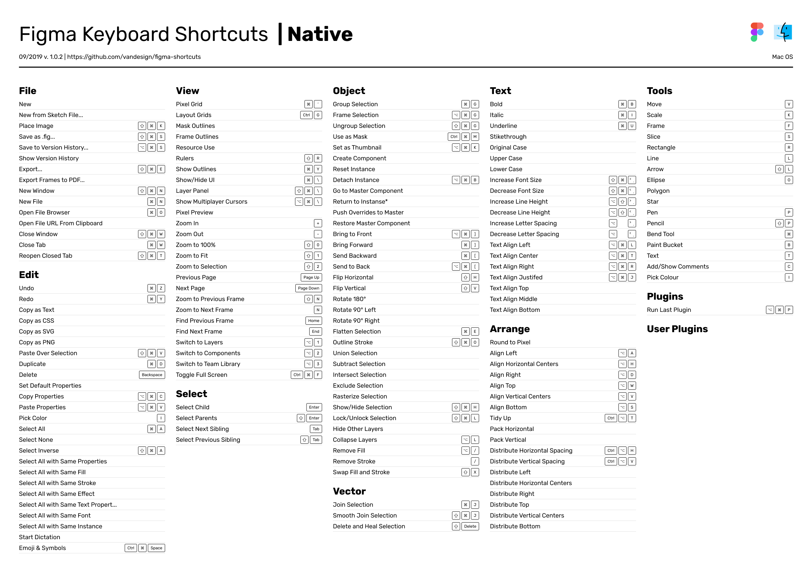
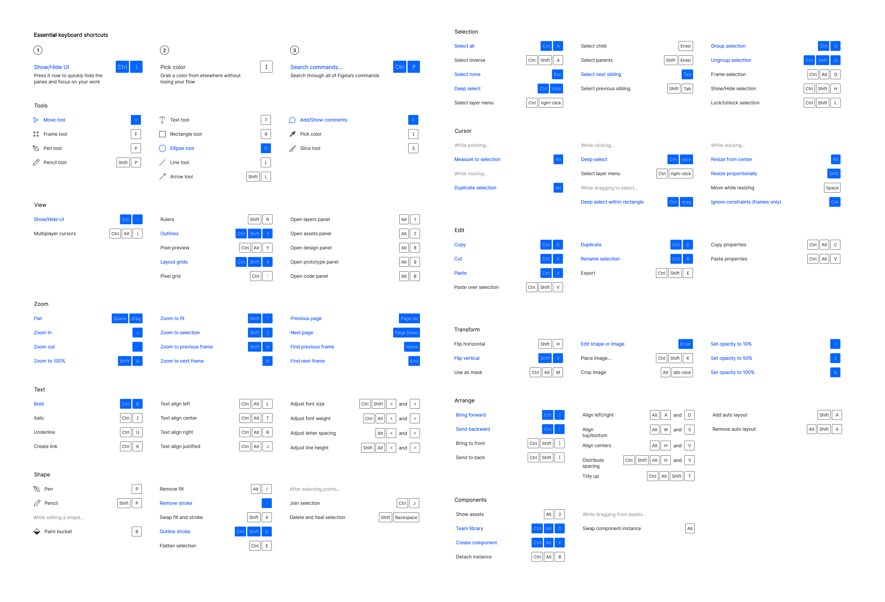
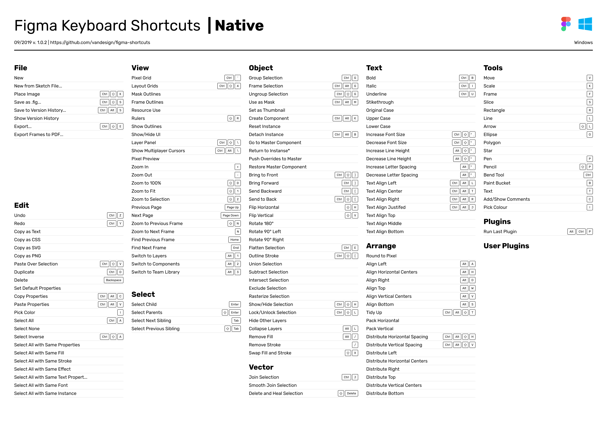
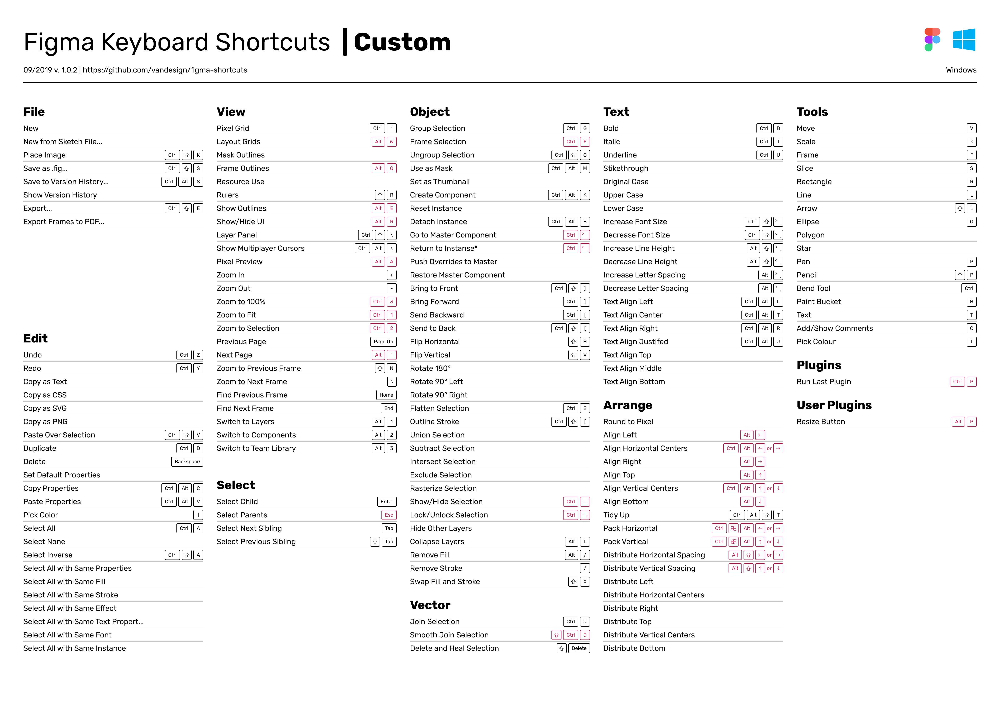

# Figma and UI/UX Design

# Figma: Get started

## Understanding and Utilizing User Personas in Design

### What is a User Persona?

A user persona is a semi-fictional representation of your ideal customer or user, created based on market research and real data about your existing customers. Think of it as creating a detailed character profile – like an author would for a novel – but this character represents your target audience. This isn't just any imaginary user; it's a carefully crafted archetype that embodies the goals, behaviors, and pain points of your larger user group.

### Why User Personas Matter

When we design without clear personas, we often fall into two common traps. The first is designing for ourselves, where we unconsciously create solutions based on our own preferences and technical expertise. The second is trying to design for everyone, which typically results in a diluted, generic solution that serves no one particularly well.

### The Power of Specificity

By focusing on specific personas, we actually achieve greater universal appeal within our target market. This might seem counterintuitive, but consider this: When Instagram was first launched, it focused specifically on photography enthusiasts who wanted to share artistic photos. By designing for this specific persona, they created a platform that eventually appealed to a much broader audience while maintaining its core value proposition.

### Benefits of Using Personas in Design

Creating and using personas provides several key advantages:

1. **Focused Decision Making**: When faced with design choices, you can ask "Would Sarah (your persona) understand this?" or "Would this solve Tom's problem?" This makes decision-making more concrete and less abstract.
2. **Stakeholder Communication**: Personas give you a powerful tool for defending design decisions to stakeholders. Instead of arguing based on personal preferences, you can reference your persona's needs and behaviors.
3. **Team Alignment**: When everyone on the team understands who they're designing for, it creates consistency across the product and helps align different departments (design, marketing, development) around common user goals.
4. **Empathy Building**: Personas help team members who aren't in direct contact with users understand and empathize with the end users' needs and frustrations.

### Creating Effective Personas

To create useful personas, include:

- Demographic information (age, occupation, location)
- Goals and motivations
- Pain points and frustrations
- Technical proficiency level
- Typical behaviors and preferences
- Quote that captures their attitude
- A day in their life
- Key scenarios where they might use your product

### Common Pitfalls to Avoid

Remember that personas should be:

- Based on research, not assumptions
- Specific enough to be meaningful but not so specific they limit thinking
- Regularly updated as you learn more about your users
- Used consistently across your design process, not created and forgotten

### Implementation in Design Process

When working on any feature or design element, always start by asking:

1. How does this serve our persona's goals?
2. Does this align with their technical proficiency?
3. Would this fit naturally into their daily routine?
4. Does this address their primary pain points?

The key is to let your personas guide your design decisions while remaining flexible enough to incorporate new insights as they emerge from user research and feedback.

Remember: Personas are tools for focus, not constraints. They should inspire better design decisions by keeping the team aligned around real user needs rather than limiting creativity or innovation.

# Wireframing in Modern UI/UX Design

## Understanding the Wireframing Spectrum

Wireframing exists on a spectrum from low-fidelity (Lo-Fi) to high-fidelity (Hi-Fi), with each approach serving distinct purposes in the design process. Let's explore these in detail.

## Low-Fidelity Wireframes

### Core Characteristics

Low-fidelity wireframes are the initial visual representations of your user interface, stripped down to their most basic elements. They serve as the skeletal framework of your design, focusing on layout, space allocation, and content prioritization rather than visual design.

### Key Components

- Basic shapes and lines representing UI elements
- Placeholder text (often Lorem Ipsum)
- Simple boxes for images
- Rudimentary navigation elements
- Basic content blocks

### Strategic Benefits

The deliberate simplicity of Lo-Fi wireframes offers several advantages:

1. Rapid Iteration: Their basic nature allows for quick modifications, making them ideal for early-stage experimentation.
2. Stakeholder Focus: Without visual distractions, stakeholders can concentrate on fundamental layout and functionality decisions.
3. Design Flexibility: The abstract nature prevents premature commitment to specific design choices.
4. Resource Efficiency: Quick creation and modification save valuable project time and resources.

### Best Practices for Lo-Fi Wireframing

When creating low-fidelity wireframes, consider these advanced approaches:

1. Information Architecture First: Begin with content hierarchy and user flow before adding any visual elements.
2. Consistent Abstraction: Maintain the same level of detail across all elements to prevent focus bias.
3. Strategic Annotation: Include clear notes about functionality and interaction patterns.
4. Modular Thinking: Design reusable components that can be easily modified across different screens.

## High-Fidelity Wireframes

### Core Characteristics

Hi-Fi wireframes represent a more mature stage in the design process, incorporating specific visual elements while still maintaining focus on functionality and user experience.

### Key Components

- Accurate typography and font choices
- Specific spacing and alignment
- Actual content (rather than placeholder text)
- Detailed navigation elements
- Interactive components
- Color schemes (though often in grayscale)

### Strategic Applications

Hi-Fi wireframes serve several crucial purposes:

1. Detailed Documentation: They provide comprehensive specifications for development teams.
2. User Testing: Their increased detail makes them suitable for meaningful usability testing.
3. Stakeholder Presentation: They help stakeholders visualize the final product more accurately.
4. Design System Integration: They can incorporate elements from existing design systems.

### Advanced Hi-Fi Wireframing Techniques

1. Component-Based Architecture

   - Create a library of reusable components
   - Establish clear naming conventions
   - Document component behavior and states
   - Define component relationships and hierarchy
2. Interaction Design Integration

   - Document micro-interactions
   - Define state changes
   - Specify animation timing and behavior
   - Include error states and edge cases
3. Responsive Considerations

   - Define breakpoint behavior
   - Document component adaptation rules
   - Specify layout changes across devices
   - Include touch target specifications

## The Bridge Between Lo-Fi and Hi-Fi

### Strategic Progression

Understanding when and how to move from Lo-Fi to Hi-Fi wireframes is crucial:

1. Validation Points: Establish clear criteria for progressing from Lo-Fi to Hi-Fi
2. Iterative Refinement: Create feedback loops between both fidelity levels
3. Documentation Evolution: Maintain clear documentation of design decisions during transition
4. Stakeholder Involvement: Define appropriate stakeholder input at each stage

### Common Pitfalls to Avoid

1. Premature Detail: Adding too much detail too early in the process
2. Inconsistent Fidelity: Mixing different fidelity levels without purpose
3. Skipping Validation: Moving to Hi-Fi before Lo-Fi concepts are validated
4. Over-specification: Including unnecessary detail that constrains development

## Tools and Technologies

### Lo-Fi Wireframing Tools

- Paper and pencil
- Balsamiq
- Whimsical
- Miro's wireframing features

### Hi-Fi Wireframing Tools

- Figma
- Adobe XD
- Sketch
- Axure RP

### Selection Criteria

When choosing tools, consider:

- Team collaboration needs
- Integration requirements
- Handoff processes
- Learning curve
- Version control capabilities

## Measuring Wireframe Effectiveness

### Quality Metrics

- Clarity of communication
- Consistency across screens
- Component reusability
- Documentation completeness
- Implementation feasibility

### Validation Methods

- Stakeholder reviews
- Developer feedback
- User testing (especially for Hi-Fi)
- Heuristic evaluation
- Accessibility assessment

## Future Considerations

As design tools and methodologies evolve, consider these emerging trends:

1. AI-Assisted Wireframing: Understanding the role of AI in generating and validating wireframes
2. Design System Integration: Closer integration with design system tools and processes
3. Cross-Platform Considerations: Adapting wireframes for emerging platforms and devices
4. Collaborative Workflows: Evolution of real-time collaboration in wireframing

# Figma shortcuts

## Sample 1




## Sample 2



## Sample 3



## Costume



# Default Properties and Best Practices for Figma Components

## Core Principles for Default Setup

### Base Properties Configuration

When setting up default properties for components in Figma, follow these fundamental principles:

1. **Layout Properties**

   - Always set Auto-layout as the default for new frames and components
   - Configure default padding (16px for containers, 8px for internal spacing)
   - Set consistent corner radius values (4px for small elements, 8px for cards)
   - Enable constraints relative to parent frame
2. **Color System Integration**

   - Define color styles before creating components
   - Set default fill colors using design tokens
   - Configure default stroke properties (1px, solid)
   - Establish hover and active states using color variables

### Rectangle Component Best Practices

1. **Foundation Settings**

   - Name convention: `rectangle/[purpose]/[variant]`
   - Default corner radius: 4px (adjustable via component properties)
   - Enable "Preserve ratio" for icons and logos
   - Set default constraints to "Scale" for responsive behavior
2. **Advanced Properties**

   - Configure auto-layout properties for consistent spacing
   - Set up component properties for:
     - Corner radius variations (0, 4, 8, 12, 16, full)
     - Fill styles (solid, gradient, transparent)
     - Border options (none, 1px, 2px)
     - Shadow variants (none, sm, md, lg)
3. **Interactive States**

   - Create variant properties for:
     - Default state
     - Hover state
     - Active state
     - Disabled state
   - Use boolean properties for toggle states

### Frame Component Standards

1. **Default Configuration**

   - Auto-layout: Vertical, 16px gap
   - Padding: 16px all sides
   - Clip content: Enabled
   - Background: Transparent
2. **Responsive Behavior**

   - Set horizontal resizing to "Hug contents"
   - Configure vertical resizing to "Fixed"
   - Enable "Fill container" for full-width scenarios

## Advanced Component Property Management

### Property Inheritance

1. **Base Component Structure**

   ```
   └── Base Component
       ├── Variants
       │   ├── Primary
       │   ├── Secondary
       │   └── Tertiary
       └── States
           ├── Default
           ├── Hover
           └── Active
   ```
2. **Property Propagation**

   - Set instance swap options
   - Configure override protection
   - Define property relationships
   - Establish component hierarchy

### Smart Components Setup

1. **Interactive Properties**

   - Configure smart animate properties
   - Set up prototype connections
   - Define interaction variables
   - Establish state management rules
2. **Advanced Constraints**

   - Left and right: Scale
   - Top and bottom: Center
   - Size: Fill container
   - Position: Relative to parent

## Best Practices for Production

1. **Component Organization**

   - Use clear naming conventions
   - Group related components
   - Maintain component description
   - Document component usage
2. **Performance Optimization**

   - Minimize nested instances
   - Use boolean properties for toggles
   - Optimize variant combinations
   - Implement efficient constraints
3. **Version Control**

   - Maintain component changelog
   - Use semantic versioning
   - Document breaking changes
   - Implement deprecation strategy

## Component Property Checklist

- [ ] Default layout properties configured
- [ ] Color styles and variables integrated
- [ ] Interactive states defined
- [ ] Responsive behavior set
- [ ] Component properties documented
- [ ] Variant structure organized
- [ ] Smart animations configured
- [ ] Performance optimizations applied
- [ ] Version control implemented
- [ ] Usage guidelines documented

## Common Pitfalls to Avoid

1. **Structure Issues**

   - Inconsistent naming conventions
   - Overcomplicating variant structure
   - Neglecting component documentation
   - Poor property organization
2. **Performance Problems**

   - Excessive nesting of components
   - Overuse of complex constraints
   - Unnecessary variant combinations
   - Inefficient property inheritance
3. **Maintenance Challenges**

   - Incomplete version control
   - Poor documentation
   - Inconsistent updates
   - Unclear deprecation process

# Typography and Color Systems in Figma

## Typography System Architecture

### Type Scale Foundation

1. **Mathematical Scale Configuration**

   ```
   Base size: 16px
   Scale ratio: 1.250 (Major Third)

   Display: 3.052rem (48.83px)
   H1: 2.441rem (39.06px)
   H2: 1.953rem (31.25px)
   H3: 1.563rem (25.00px)
   H4: 1.25rem (20.00px)
   Body: 1rem (16.00px)
   Small: 0.8rem (12.80px)
   XSmall: 0.64rem (10.24px)
   ```
   also can you [typescale](https://typescale.com/) website for creating other standards scale.

2. **Advanced Text Properties**

   - Line height ratios: 1.25 (tight), 1.5 (normal), 1.75 (loose)
   - Letter spacing: -0.025em (headings), 0 (body), 0.025em (small)
   - Paragraph spacing: 0.75em (default), 1em (relaxed)
   - OpenType features configuration

### Typography Styles Structure

1. **Naming Convention**

   ```
   [category]/[variant]/[weight]-[size]

   Examples:
   heading/display/bold-48
   body/paragraph/regular-16
   ui/button/medium-14
   ```
2. **Style Organization**

   ```
   └── Typography
       ├── Display
       │   ├── Regular
       │   └── Bold
       ├── Heading
       │   ├── H1
       │   ├── H2
       │   ├── H3
       │   └── H4
       ├── Body
       │   ├── Large
       │   ├── Regular
       │   └── Small
       └── UI
           ├── Button
           ├── Caption
           └── Label
   ```

### Responsive Typography

1. **Breakpoint Scale**

   ```
   Mobile: 16px base
   Tablet: 16px base (1:1)
   Desktop: 18px base (1.125:1)
   Large: 20px base (1.25:1)
   ```
2. **Fluid Typography Implementation**

   ```css
   /* Example scaling formula */
   font-size: clamp(1rem, 0.5rem + 1vw, 1.25rem);
   ```

## Color System Architecture

### Color Token Hierarchy

1. **Global Color Tokens**

   ```
   └── Global
       ├── Primary
       │   ├── 50: #F0F9FF
       │   ├── 100: #E0F2FE
       │   ├── 200: #BAE6FD
       │   ├── 300: #7DD3FC
       │   ├── 400: #38BDF8
       │   ├── 500: #0EA5E9
       │   ├── 600: #0284C7
       │   ├── 700: #0369A1
       │   ├── 800: #075985
       │   └── 900: #0C4A6E
       └── Neutral
           ├── 50: #F8FAFC
           ├── 100: #F1F5F9
           ├── 200: #E2E8F0
           ├── 300: #CBD5E1
           ├── 400: #94A3B8
           ├── 500: #64748B
           ├── 600: #475569
           ├── 700: #334155
           ├── 800: #1E293B
           └── 900: #0F172A
   ```
2. **Semantic Color Tokens**

   ```
   └── Semantic
       ├── Background
       │   ├── Primary
       │   ├── Secondary
       │   └── Tertiary
       ├── Text
       │   ├── Primary
       │   ├── Secondary
       │   └── Disabled
       ├── Border
       │   ├── Default
       │   ├── Hover
       │   └── Active
       └── Status
           ├── Success
           ├── Warning
           ├── Error
           └── Info
   ```

### Color Management Best Practices

1. **Color Style Organization**

   - Use consistent naming patterns
   - Group colors by purpose
   - Maintain color description
   - Document usage guidelines
2. **Color Variables Implementation**

   ```
   └── Variables
       ├── Light Theme
       │   ├── Background
       │   ├── Text
       │   └── Border
       └── Dark Theme
           ├── Background
           ├── Text
           └── Border
   ```

### Advanced Color Applications

1. **Gradient System**

   ```
   └── Gradients
       ├── Linear
       │   ├── Primary
       │   └── Accent
       ├── Radial
       │   ├── Subtle
       │   └── Bold
       └── Angular
           ├── Decorative
           └── Background
   ```
2. **Color Contrast Requirements**

   - AA Standard: 4.5:1 (text)
   - AAA Standard: 7:1 (text)
   - Large Text: 3:1 (AA)
   - UI Components: 3:1 minimum

## Implementation Guidelines

### Typography Integration

1. **Component Typography**

   - Set default text styles
   - Configure text properties
   - Establish hierarchy rules
   - Define responsive behavior
2. **Text Style Management**

   - Create style variants
   - Set up text properties
   - Configure OpenType features
   - Establish style relationships

### Color Implementation

1. **Component Color Usage**

   - Apply semantic tokens
   - Set interactive states
   - Configure dark mode
   - Handle special states
2. **Color Style Management**

   - Create color variables
   - Set up color modes
   - Configure color schemes
   - Establish color relationships

## Quality Assurance Checklist

### Typography Verification

- [ ] All text styles follow naming convention
- [ ] Line heights are consistently applied
- [ ] Letter spacing is appropriate
- [ ] OpenType features are configured
- [ ] Responsive scaling is implemented

### Color System Verification

- [ ] Color tokens are properly organized
- [ ] Semantic colors are consistently applied
- [ ] Color contrast meets accessibility standards
- [ ] Dark mode variations are configured
- [ ] Color variables are properly linked

## Common Typography & Color Pitfalls

1. **Typography Issues**

   - Inconsistent scale implementation
   - Poor responsive behavior
   - Missing text styles
   - Incorrect OpenType settings
2. **Color System Problems**

   - Inconsistent token usage
   - Poor contrast ratios
   - Incomplete dark mode
   - Unorganized color styles
3. **Management Challenges**

   - Undefined naming conventions
   - Missing documentation
   - Inconsistent updates
   - Poor version control

# Frames and Groups Management

## Frame Architecture Principles

### Frame Hierarchy System
```
└── Page
    ├── Section Frame
    │   ├── Component Frame
    │   │   ├── Element Frame
    │   │   └── Element Frame
    │   └── Component Frame
    └── Section Frame
        └── Component Frame
            └── Element Frame
```

### Frame Naming Convention
```
[type]/[purpose]/[variant]

Examples:
section/hero/default
component/card/primary
element/input/active
```

## Advanced Frame Configuration

### 1. Layout Frames

#### Desktop Breakpoint Frame
- Width: 1440px (default)
- Auto-layout: Vertical
- Padding: 64px horizontal, 40px vertical
- Gap: 80px between sections
- Alignment: Center children
- Properties:
  ```
  Constraints: Center
  Layout Mode: Vertical
  Layout Align: Center
  Clip Content: False
  ```

#### Responsive Frame Settings
```
Desktop: 1440px
Tablet: 768px
Mobile: 375px

Properties per breakpoint:
- Padding scales: 64/32/16
- Gap scales: 80/40/24
- Margins scale: 40/24/16
```

### 2. Component Frames

#### Container Properties
```
Default settings:
- Auto-layout: Enabled
- Padding: 24px
- Gap: 16px
- Radius: 8px
- Stroke: 1px (if needed)
- Background: System color
```

#### Interactive States
```
└── Component Frame
    ├── Default
    ├── Hover
    ├── Active
    └── Disabled
```

### 3. Element Frames

#### Atomic Element Structure
```
└── Element Frame
    ├── Icon
    ├── Text
    └── Interactive Area
```

#### Configuration Settings
```
Properties:
- Size: Fixed or Hug
- Constraints: Scale
- Layout: Based on content
- Clipping: As needed
```

## Groups vs Frames Best Practices

### When to Use Groups

1. **Temporary Combinations**
   - Quick iterations
   - Exploration phases
   - Non-reusable elements

2. **Simple Layouts**
   - Static elements
   - Illustration parts
   - Decorative elements

3. **Performance Optimization**
   - Lightweight grouping
   - Simple transforms
   - Basic selections

### When to Use Frames

1. **Complex Layouts**
   - Auto-layout requirements
   - Responsive behavior
   - Nested components

2. **Interactive Elements**
   - Prototype connections
   - State management
   - User interactions

3. **Component Architecture**
   - Design systems
   - Reusable patterns
   - Variant management

## Advanced Frame Techniques

### 1. Constraint Management
```
Parent Frame
├── Fixed Position
│   └── Pinned to edges
├── Flexible Width
│   └── Left & Right: Scale
└── Centered Content
    └── Center constraints
```

### 2. Auto-layout Patterns

#### Stack Patterns
```
Vertical Stack
├── Gap: 16px
├── Padding: 24px
└── Alignment: Center

Horizontal Stack
├── Gap: 8px
├── Padding: 16px
└── Alignment: Center
```

#### Grid Systems
```
Grid Frame
├── Columns: 12
├── Margin: 24px
├── Gutter: 16px
└── Alignment: Stretch
```

### 3. Frame Masking
```
Mask Frame
├── Shape Layer
├── Content Layer
└── Mask Settings
    ├── Clip content
    └── Layer effects
```

## Organization Strategies

### 1. Page Structure
```
Project
└── Pages
    ├── 📱 Mobile
    ├── 💻 Desktop
    ├── 🎨 Design System
    └── 🚧 WIP
```

### 2. Frame Management
```
Page
└── Sections
    ├── Header
    │   └── Components
    ├── Main Content
    │   └── Components
    └── Footer
        └── Components
```

### 3. Component Organization
```
Design System
└── Components
    ├── Atomic
    ├── Molecular
    └── Organisms
```

## Performance Optimization

### 1. Frame Efficiency
- Minimize nested frames
- Use groups for static content
- Optimize auto-layout usage
- Reduce unnecessary constraints

### 2. Memory Management
- Clean up unused frames
- Remove hidden layers
- Optimize large frames
- Use components efficiently

## Quality Assurance Checklist

### Frame Structure
- [ ] Consistent naming convention
- [ ] Proper hierarchy
- [ ] Organized layers
- [ ] Clean constraints

### Layout Verification
- [ ] Auto-layout configuration
- [ ] Responsive behavior
- [ ] Proper spacing
- [ ] Alignment consistency

### Performance Checks
- [ ] Optimal nesting
- [ ] Efficient grouping
- [ ] Clean organization
- [ ] Memory optimization

## Common Pitfalls

### 1. Structural Issues
- Excessive frame nesting
- Inconsistent naming
- Poor hierarchy
- Messy constraints

### 2. Layout Problems
- Broken auto-layout
- Inconsistent spacing
- Poor responsive behavior
- Alignment issues

### 3. Performance Issues
- Too many nested frames
- Unnecessary groups
- Unorganized structure
- Heavy frame usage

## Troubleshooting Guide

### Common Issues Resolution
1. **Broken Layouts**
   - Check auto-layout settings
   - Verify constraints
   - Review padding/margins
   - Check alignment

2. **Performance Problems**
   - Reduce nesting
   - Optimize groups
   - Clean up unused frames
   - Simplify complex structures

3. **Organization Issues**
   - Implement naming convention
   - Reorganize hierarchy
   - Clean up layers
   - Document structure

# Layout Grid Systems

## Core Grid Architecture

### Industry Standard Column Grids

1. **Desktop Layouts (1440px)**
   ```
   Standard 12-Column Grid
   ├── Columns: 12
   ├── Margin: 80px
   ├── Gutter: 24px
   └── Column width: 88px (fluid)

   Alternate 16-Column Grid
   ├── Columns: 16
   ├── Margin: 64px
   ├── Gutter: 16px
   └── Column width: 64px (fluid)
   ```

2. **Tablet Layouts (768px)**
   ```
   Standard 8-Column Grid
   ├── Columns: 8
   ├── Margin: 32px
   ├── Gutter: 16px
   └── Column width: 77px (fluid)
   ```

3. **Mobile Layouts (375px)**
   ```
   Standard 4-Column Grid
   ├── Columns: 4
   ├── Margin: 16px
   ├── Gutter: 16px
   └── Column width: 73.75px (fluid)
   ```

### Grid Calculation Formulas

```
Available Width = Screen Width - (2 × Margin)
Column Width = (Available Width - (Gutters × (Columns - 1))) ÷ Columns

Example (1440px desktop):
Available Width = 1440px - (2 × 80px) = 1280px
Column Width = (1280px - (24px × 11)) ÷ 12 = 88px
```

## Advanced Grid Configurations

### 1. Nested Grid Systems

```
Parent Grid (12 columns)
└── Nested Grid (6 columns)
    └── Nested Grid (3 columns)

Nesting Rules:
- Maintain consistent ratios
- Adjust gutters proportionally
- Preserve margin relationships
```

### 2. Compound Grid Systems

```
Layout Grid Stack
├── Column Grid (Structure)
├── Baseline Grid (Typography)
└── Pixel Grid (Details)

Properties:
- Color coding for visibility
- Selective visibility states
- Grid-specific settings
```

## Grid Standards by Industry

### 1. Enterprise Applications
```
Desktop (1440px)
├── Columns: 12
├── Margin: 64px
├── Gutter: 24px
└── Dense layout priority

Characteristics:
- Narrower margins
- Consistent gutters
- Information density
```

### 2. Marketing Websites
```
Desktop (1440px)
├── Columns: 12
├── Margin: 80px-120px
├── Gutter: 32px
└── Breathing space priority

Characteristics:
- Wider margins
- Larger gutters
- Emphasis on whitespace
```

### 3. E-commerce Platforms
```
Desktop (1440px)
├── Columns: 16
├── Margin: 48px
├── Gutter: 16px
└── Product grid optimization

Characteristics:
- Product card alignment
- Flexible item layouts
- Category organization
```

## Grid Component Relationships

### 1. Component Sizing Standards
```
Button Widths:
├── Small: 2 columns
├── Medium: 3 columns
└── Large: 4 columns

Card Layouts:
├── Small: 3 columns
├── Medium: 4 columns
└── Large: 6 columns
```

### 2. Spacing System Integration
```
Margin Scale:
├── 8px (atomic)
├── 16px (component)
├── 24px (section)
└── 32px+ (layout)

Grid Alignment:
├── Component edges to grid lines
├── Internal spacing to 8px system
└── Gutters as spacing reference
```

## Responsive Grid Behavior

### 1. Breakpoint Management
```
Major Breakpoints
├── Desktop Large (1920px): 12-16 columns
├── Desktop (1440px): 12 columns
├── Tablet (768px): 8 columns
└── Mobile (375px): 4 columns

Minor Breakpoints
├── Desktop Medium (1680px)
├── Desktop Small (1280px)
├── Tablet Portrait (834px)
└── Mobile Large (428px)
```

### 2. Grid Transformation Rules
```
Column Adaptation
├── Maintain column count until breakpoint
├── Adjust margins proportionally
├── Preserve gutter relationships
└── Recalculate column widths

Content Reflow
├── Stack on smaller screens
├── Maintain hierarchy
├── Preserve readability
└── Optimize touch targets
```

## Grid Setup Best Practices

### 1. Initial Configuration
```
Frame Setup
├── Set width to breakpoint
├── Enable layout grid
├── Configure columns
└── Set color and opacity

Grid Properties
├── Define count and width
├── Set margins and gutters
├── Configure alignment
└── Save as grid style
```

### 2. Grid Style Management
```
Grid Styles
├── [breakpoint]/[columns]/[purpose]
├── Desktop/12col/default
├── Tablet/8col/dense
└── Mobile/4col/default
```

## Advanced Techniques

### 1. Multi-Column Layouts
```
Asymmetric Grids
├── 5+7 split
├── 4+4+4 split
├── 8+4 split
└── Custom ratios

Dynamic Spans
├── Content-based spanning
├── Responsive adjustments
└── Breakpoint adaptations
```

### 2. Grid Customization
```
Special Cases
├── Full-bleed sections
├── Edge-to-edge content
├── Offset layouts
└── Overlapping elements
```

## Common Grid Values Reference

### 1. Column Counts
```
Standard Options:
- 12 columns (most common)
- 16 columns (dense layouts)
- 8 columns (tablet)
- 4 columns (mobile)
```

### 2. Margin Values
```
Desktop:
- Minimum: 48px
- Standard: 80px
- Generous: 120px

Tablet:
- Minimum: 24px
- Standard: 32px
- Generous: 48px

Mobile:
- Minimum: 12px
- Standard: 16px
- Generous: 24px
```

### 3. Gutter Values
```
Desktop:
- Dense: 16px
- Standard: 24px
- Generous: 32px

Tablet/Mobile:
- Dense: 12px
- Standard: 16px
- Generous: 24px
```

## Quality Assurance Checklist

### Grid Setup
- [ ] Correct column count for breakpoint
- [ ] Appropriate margins for screen size
- [ ] Consistent gutter spacing
- [ ] Grid styles properly saved

### Responsive Behavior
- [ ] Graceful column adaptation
- [ ] Proper content reflow
- [ ] Maintained visual hierarchy
- [ ] Consistent spacing system

### Component Alignment
- [ ] Elements snap to grid
- [ ] Consistent spacing usage
- [ ] Proper nesting implementation
- [ ] Clear content hierarchy

## Common Pitfalls

1. **Setup Issues**
   - Inconsistent margin values
   - Improper gutter spacing
   - Misaligned columns
   - Poor grid style management

2. **Responsive Problems**
   - Broken layouts at breakpoints
   - Inconsistent column adaptation
   - Poor content reflow
   - Spacing inconsistencies

3. **Implementation Challenges**
   - Over-reliance on grid exceptions
   - Inconsistent component sizing
   - Poor nested grid implementation
   - Unclear grid hierarchy

